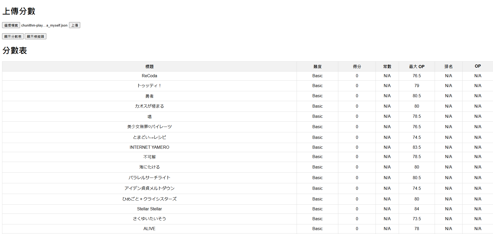
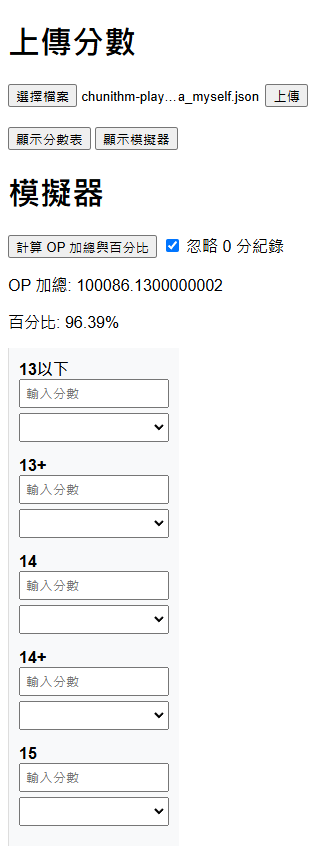
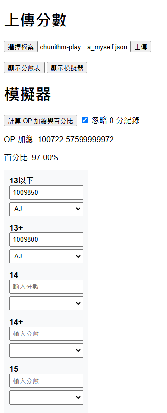

# 簡介

簡單的flask網站，用於模擬計算Chunithm清譜後的op夠不夠拿板子 
可以先透過以下書籤工具下載全部歌曲列表(來源為：https://reiwa.f5.si/newbestimg/chunithm_int/) 
javascript:(function(){var e=document.createElement("script");e.src="https://reiwa.f5.si/chuni_scoredata/main.js?"+String(Math.floor((new Date).getTime()/1e3)),document.body.appendChild(e)})(); 
songdata.json來源為經過處理的otogeDB資料 

# 使用方式  

### 按下選擇檔案並上傳之後會跳到分數表頁面
### 可以透過按鈕切換到模擬頁面
 
### 模擬頁面按下計算後會求出當前op數值與百分比，旁邊有選項可以忽略0分的歌  
 
### 在框框內填入數字/FCAJ符號，可以讓計算時，該區段難度的歌最低修改為該分數，按下計算按鈕才會重新計算  
 

# TODO  
計算有些許偏差(maxop多了20，懷疑是某首歌定數跑掉)  